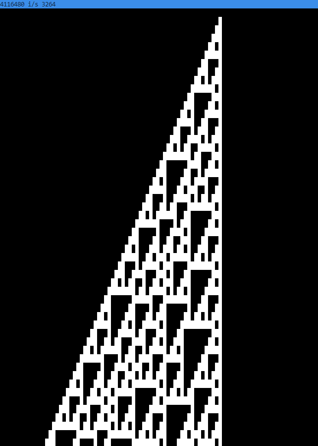

# ToastLang

ToastLang (`tl`) is a compiled language that compiles down to `tasm` (see: `assembler`) which can be further compiled 
down to the `Toast architecture instruction set`. The resulting binary (`.mif` file) can be
run through the emulated ToastCPU or fpga implementation. Toastlang should not be used to compile to any architecture other 
than `ToastCPU` since a lot of limitations were designed with `ToastCPU` in mind.

`tl` is a stack-based concatenative language, similar to `Forth`, `Porth`, and `Joy`. However,
unlike a pure stack-based language, it supports static allocation on the heap, and uses an
additional `return` stack to retain information about function call return address and any
local variable bindings. Think of this additional `return` stack as a more traditional stack-frame 
calling architecture.

It also supports global static memory allocations with name bindings, unlike `Forth`.

## Features

The following list of features are subject to change as development continues.

### Hello World
```rust
fn main -> {
    "Hello from a piece of toast!\n" io::print
}
```

### Basic Arithmetic
```rust
fn main -> {
  1 2 + io::print_word
}
```

This piece of code pushes `1` and `2` on to the stack. Then, the `+` operator pops two values from the stack and pushes 
the sum on to the stack. The `io::print_word` function prints out the resulting number in hex notation.

### Defining Functions

Functions are defined using the `fn` keyword -- like you've been doing with the `main` function! Functions that alter the stack
are required to declare these effects using the `->` definition. As seen below, the `add` function requires two `u16` types at the 
top of the stack, which is transformed into a single `u16` at the top of the stack. 

```rust
fn add u16 u16 -> u16 {
  +
}

fn main -> {
  1 2 add
}
```

### Defining Structs

### Defining Methods on Structs

### Turing Completeness

Very technically (and not *really* rooted in reality), `toastlang` (and by extension, `toastasm` and `toastcpu`) is turing complete, since it is able to implement a 100-cell wide 
r110 cellular automata.



## Todo
- [x] Add static type checking to functions
- [x] File include system
- [ ] Deprecate file include system and add actual modules
- [x] Add structs support
- [x] Add const array offset support `0xDEAD ptr [2] store`
- [ ] Add better control flow
  - [x] `return` Jump to end of function 
    - [ ] todo: Make better control flow checks when returning or breaking 
  - [ ] `break` Jump out of current loop
  - [ ] Refactor type checking to account for early return or break
  - [ ] Implement switch/match statements + if/elseif/else statements, and lower them to nested ifs.
- [ ] Better static compiler check error messages
- [x] Add global static memory allocation
  - [x] `global foo u16 100` Denotes global variable called `foo` which will be initialized with `u16: 100`
  - [x] `global foo [12] u16 0` Add support for array allocation in global variables
- [ ] Add `const` and `inline`
  - [ ] `const foo u16 100` pushes the address of foo to the stack. Similar to strings but better and reused!
  - [x] `inline foo 100` pushes the *value* of foo to the stack. The substitution happens at compile time, and 
        doesn't require any rom allocation. Inline values are expanded out like macros.
- [x] Add support for pattern matched type defs
  - `pub fn foo $a $a* $b -> $b* { ... }` Generics!
- [ ] Dead code elimination
  - [x] Function tree-shake / dead-code elimination
  - [ ] Global allocation
- [ ] Module system to prevent nameclash: `mod io { struct a ... fn b ... }` referenced as `io::a` and `io::b`
  - [x] Basic functionality
  - [x] Add `using` keyword to remove the need for prepending `io::`, for example.
  - [x] See ~`Rough edges around modules`~
    - [ ] Clean up the code though...
  - [ ] Instead of searching through all `using`s, create a datastructure to map shortnames -> items and pass that around
- [ ] Function pointers
  - [x] Express types like `(u16 -> u16)` or `($a -> u16*)`
  - [ ] Fix generic function type annotation (See appendix)
  - [x] Better parsing of types instead of overloading identifiers
  - [ ] Better parsing of module member types instead of overloading identifier
- [ ] Recursive struct definitions if size is known at compile time
- [ ] `bool` type
  - [x] `true` and `false` literals
  - [x] let `if` statements use both `u16` and `bool`
  - [ ] logical operators `&&`, etc. to emit `bool` instead of `u16`
- [ ] `char` type
- [ ] `cond` blocks 
  - `true cond { { dup } { drop } { dup ! } { drop } } `
- [ ] Structs on the stack (See appendix)
- [ ] If no structs on the stack, then implement psuedotypes
  - `type u16 bool Optional`
  - `fn a -> Optional { 1 true }`
  - These differ from structs in that they can exist on the stack, since they are completely transparent. For example, when calling `a`, 
    the caller will see a `u16` and a `bool` directly on a stack. 

## Appendix

### Problem 1

This doesn't work

```
fn generic_bug $a -> {
  let a {
    a drop
  }
}
```

This is because when we push `a` on to the stack, it will try to resolve that type. 
However, this should not error, since the `$a` that it is trying to resolve was introduced in the function.

Similar thing happens with the output type of a function pointer.

```
fn generic_hackery $a (u16 -> $a)* -> {
  1 () drop drop
}
```

It results in `Output generic "a" has no corresponding input type.`

Why? 

Because when we call the generic function using the `()` operator, we try to resolve the type `$a` within `generic_hackery`. This is not ideal as we only need to make sure that the two `$a` are the same. This can (and is) done when `generic_hackery` is called from other functions. 

I don't know how to fix this and I don't really know if it matters...

### Structs on the stack

So... the semantics of this is kinda complicated, since operations like `drop` assume fixed-sized operands. I'm inclined to not implement this, since 
doing a simple `swap` may require large amount of `memcpy`. A good (?) alternative are `type` declarations, which will transparently push
its items on to the stack, as separate elements.